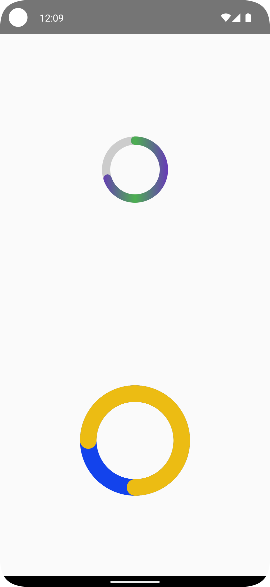

# CustomCircularProgressBarComposable

  

## Medium Article and Overview

The `CustomCircularProgressBar()` is a dynamic and reactive UI component for Android, built with Kotlin and Jetpack Compose, and is detailed in an accompanying Medium article. The article provides a comprehensive guide on the implementation and design of the composable, highlighting its customizability and animation features. It serves as an excellent resource for Android developers seeking to understand the nuances of Compose and Kotlin in UI development. For an in-depth exploration, read the Medium article [here](https://medium.com/@kenruizinoue/intermediate-android-compose-tutorial-building-a-custom-circular-progress-bar-88d316963a57).

## Main Components

This repo includes these implementations that work together to display a customizable and animated circular progress bar:

- `CustomerCircularProgressBar()`: The core Composable function that renders the circular progress bar.
- `progressFlow()`: A helper function that generates a Flow of Float values to simulate progress animation.
- `MainActivity`: Demonstrates the implementation of the `CustomerCircularProgressBar()` in a real-world application context.

## Design and Implementation

The `CustomCircularProgressBar()` stands as an example of the flexibility Jetpack Compose offers when designing complex UIs by using the `Canvas()` composable. It features the capability to customize aspects such as the progress arc color, start angle, size, and stroke width. Furthermore, it provides an option for animated progress, adding a dynamic visual effect to the progress bar.

## Getting Started

To get started:

1. Clone the repository to your local machine.
2. Open the project in Android Studio Arctic Fox or later to ensure full Compose support.
3. Build and run the app on an emulator or a physical device to see the composable in action.
